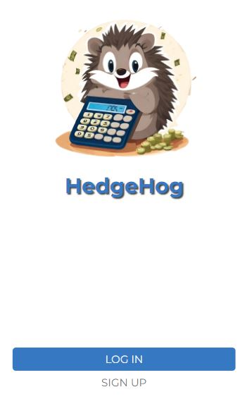

<a name="readme-top">HedgeHog</a>

<div align="center">

 <!-- LOGO -->

  
  <br/>

<!-- MAIN HEADING -->

  <h3><b>HedgeHog</b></h3>

</div>

<!-- TABLE OF CONTENTS -->
# 📗 Table of Contents

- [📗 Table of Contents](#-table-of-contents)
- [📖 HedgeHog- Budget ](#-hedgehog--budget-)
  - [🛠 Built With ](#-built-with-)
    - [Tech Stack ](#tech-stack-)
    - [Key Features ](#key-features-)
  - [🚀 Live Demo ](#-live-demo-)
  - [💻 Getting Started ](#-getting-started-)
    - [Setup](#setup)
    - [Prerequisites](#prerequisites)
    - [Install](#install)
    - [Usage](#usage)
    - [Run tests](#run-tests)
  - [👥 Authors ](#-authors-)
  - [🔭 Future Features ](#-future-features-)
  - [🤝 Contributing ](#-contributing-)
  - [⭐️ Show your support ](#️-show-your-support-)
  - [🙏 Acknowledgments ](#-acknowledgments-)
  - [❓ FAQ (OPTIONAL) ](#-faq-optional-)
  - [📝 License ](#-license-)

<!-- INTRO -->
# 📖 HedgeHog- Budget <a name="about-project"></a>

> HedgeHog is a Budget app built with Ruby on Rails. You can create categories and have a list of transactions associated with a category, you can add new transactions and see the money you spent in each category and transaction.

## 🛠 Built With <a name="built-with"></a>
1. Ruby
2. Rails

### Tech Stack <a name="tech-stack"></a>

<details>
  <summary>Client</summary>
  <ul>
    <li><a href="https://www.ruby-lang.org/en/">Ruby</a></li>
    <li><a href="https://rubyonrails.org/">Rails</a></li>
  </ul>
</details>

<!-- Features -->

### Key Features <a name="key-features"></a>

> - List Categories
> - Add a new Category
> - List Transactions
> - Add a new Transaction

<p align="right">(<a href="#readme-top">back to top</a>)</p>

<!-- LIVE DEMO -->

LIVE DEMO
## 🚀 Live Demo <a name="live-demo"></a> 


- [Live Demo Link](https://hedgehog.onrender.com/)

<p align="right">(<a href="#readme-top">back to top</a>)</p>

<!-- GETTING STARTED -->

## 💻 Getting Started <a name="getting-started"></a>

> To get a local copy of the project, use this link:
> 
```sh
git clone https://github.com/BiancaMe/hedgehog.git
cd hedgehog
```

<!-- SETUP -->
### Setup

To setup this project, run this command:

```sh
bundle install
rails s
```
### Prerequisites

1. A Code Editor
2. Internet Connection
3. Git

<!-- INSTALL -->
### Install

Install this project with Iroko.

### Usage

To run the project, execute the following command:

```sh
rails s
```
### Run tests
To test the project, execute the following command:
```sh
rspec
```
<p align="right">(<a href="#readme-top">back to top</a>)</p>

<!-- AUTHORS -->
## 👥 Authors <a name="authors"></a>

👤 **Bianca Lopez**

- GitHub: [@BiancaMe](https://github.com/BiancaMe)
- Twitter: [@BiancaMeLopez](https://twitter.com/BiancaMeLopez)
- LinkedIn: [LinkedIn](https://www.linkedin.com/in/bianca-lopez-55a4a3276/)

<p align="right">(<a href="#readme-top">back to top</a>)</p>

## 🔭 Future Features <a name="future-features"></a>

- [ ] **Add Money that you have to spend per month** 
- [ ] **Add a graphic per month with all the transactions and the money you spent**

<p align="right">(<a href="#readme-top">back to top</a>)</p>

<!-- CONTRIBUTION -->
## 🤝 Contributing <a name="contributing"></a>

Contributions, issues, and feature requests are welcome!

<p align="right">(<a href="#readme-top">back to top</a>)</p>

<!--SUPPORT -->

## ⭐️ Show your support <a name="support"></a>

> If you like this project, please give it some starts ⭐️⭐️⭐️⭐️⭐️

<p align="right">(<a href="#readme-top">back to top</a>)</p>

<!-- ACKNOWLEDGEMENTS -->
## 🙏 Acknowledgments <a name="acknowledgements"></a>

> Special credit to [Gregoire Vella](https://www.behance.net/gregoirevella), the [author of the original design](https://www.behance.net/gallery/19759151/Snapscan-iOs-design-and-branding?tracking_source=&) on [behance.net](https://www.behance.net/gallery/19759151/Snapscan-iOs-design-and-branding?tracking_source=&) used in this project and [microverseinc](https://github.com/microverseinc) for the design materials.

<p align="right">(<a href="#readme-top">back to top</a>)</p>

<!-- FAQS -->
## ❓ FAQ (OPTIONAL) <a name="faq"></a>

- **How were the Linters utilised?**

  - The Linters (Rubocop) were utilised with the help of resources provided by [@microverseinc](https://github.com/microverseinc).

<p align="right">(<a href="#readme-top">back to top</a>)</p>

<!-- LICENSE -->

## 📝 License <a name="license"></a>

This project is [MIT](./LICENSE) licensed.

<p align="right">(<a href="#readme-top">back to top</a>)</p>
